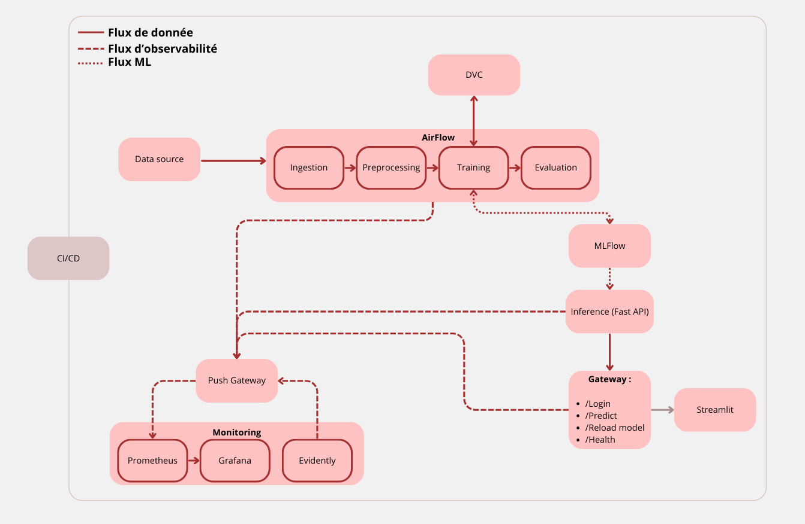

# Rakuten  — MLOps Demo  

## 📌 Introduction
Ce projet vise à prédire le prix idéal d’un produit à l’aide de modèles de Machine Learning.  
Objectif : aider les utilisateurs à définir des prix justes.

Côté technique, c’est une chaîne **MLOps complète** :

- **DVC** → versionnage des données et pipelines  
- **MLflow** → suivi des expériences et gestion des modèles  
- **FastAPI** → API REST pour l’inférence et la gateway  
- **Airflow** → orchestration des étapes (ingestion → preprocessing → training → évaluation → monitoring)  
- **Prometheus + Pushgateway** → collecte de métriques  
- **Grafana** → dashboards de suivi  

---

## 📐 Architecture





### Services Docker
| Service       | Rôle                                | Port   | URL utile |
|---------------|-------------------------------------|--------|-----------|
| Gateway       | API FastAPI (point d’entrée)        | 8002   | [http://localhost:8002/docs](http://localhost:8002/docs) |
| Inference     | API FastAPI (modèle)                | 8080   | [http://localhost:8080/docs](http://localhost:8080/docs) |
| Airflow UI    | Orchestration pipeline              | 8084   | [http://localhost:8084/](http://localhost:8084/) |
| Grafana       | Dashboards                          | 3000   | [http://localhost:3000/](http://localhost:3000/) |
| Prometheus    | Collecte métriques                  | 9090   | [http://localhost:9090/](http://localhost:9090/) |
| Pushgateway   | Métriques batch                     | 9091   | [http://localhost:9091/](http://localhost:9091/) |
| Postgres      | Base de données Airflow             | 5432   | - |

---

## ⚙️ Prérequis

- **Git**  
- **Docker + Docker Compose**  
- (Optionnel) **Python ≥ 3.8** pour lancer le frontend (Streamlit) en dehors des conteneurs  

---

## 🔑 Gestion des secrets

Les variables sensibles sont définies dans un fichier `.env` **non versionné**.  
Un exemple est fourni : [`.env.example`](.env.example).  


---

## 🚀 Installation & Exécution

### Linux

```bash
git clone https://github.com/SamMebarek/mlops-soutenance.git


# Autoriser les permissions (simple pour la démo)
sudo chmod -R 777 mlops

cd mlops

# Créer votre .env à partir du template
cp .env.example .env

# Lancer la stack Docker
docker compose up -d

```


### Windows

Ouvrez Docker Desktop.

```powershell
git clone https://github.com/SamMebarek/mlops-soutenance.git
cd rakuten-mlops

# Copier le template
copy .env.example .env

# Lancer Docker
docker compose up -d

```

## 🛠️ Pipeline Airflow

👉 Accès UI Airflow : [http://localhost:8084](http://localhost:8084)

Se connecter à l'aide des credentiels : 
  - User: admin
  - mdp : admin

Lancer le DAG Aiflow et attendre son éxecution.

Le DAG **`ml_pipeline`** orchestre les étapes :

1. **Ingestion** → charge les données sources
2. **Prétraitement** → nettoyage et enrichissement
3. **Entraînement** → XGBoost (ou autre modèle)
4. **Évaluation** → scores, logs MLflow
5. **Evidently** → détection de dérive
6. **Reload modèle** → recharge via la Gateway


### Linux

```bash

pip install streamlit
export PATH=$PATH:/home/ubuntu/.local/bin
streamlit run src/frontend/app.py
```
### Windows

```bash

pip install streamlit
streamlit run src/frontend/app.py
```

---

## 🌐 API Gateway (Streamlit)

Se connecter à l'interface avec les credentiels :
 - User : admin
 - mdp : admin

Lancer une prédiction sur une réference, ex : SKU2_4

---

## 📊 Monitoring

* **Prometheus** → [http://localhost:9090](http://localhost:9090)
* **Pushgateway** → [http://localhost:9091](http://localhost:9091)
* **Grafana** → [http://localhost:3000](http://localhost:3000)


---

## ✅ Tests & Qualité

Tests inclus :

* **Ingestion** : schéma + fichier ingéré
* **Prétraitement** : types + features temporelles
* **Training** : configs + modèle
* **Évaluation** : scores attendus

Lancer tous les tests :

```bash
pytest -q
```
